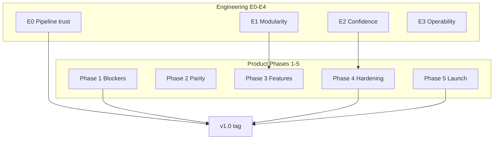

# Termy roadmap

Unified plan for **shipping v1.0** and **sustaining a 10/10 codebase**. Two tracks run in parallel; both must be healthy at launch, but only engineering **E0** is a hard gate for the v1.0 tag.

> **Baseline (2026-06-01):** app **0.3.0** · ~95k lines Rust · **1,107** `#[test]` functions · **17** workspace crates · CI: Clippy + boundaries + macOS perf/native (path-filtered)

---

## North star

| | Product | Engineering |
|---|---------|-------------|
| **Goal** | A trustworthy, cross-platform terminal users recommend | Every change is cheap, safe, and reviewable |
| **v1.0 means** | Signed builds, platform parity, expected terminal features | CI runs tests + fmt; boundaries hold; debt is scheduled not ignored |
| **10/10 means** | Polished docs, migration guides, stable releases | Scorecard gates met; no god-files; tmux/FFI/perf protected by automation |

---

## How to read this document

| Track | Document | Audience |
|-------|----------|----------|
| **Product** | This file — Phases 1–5 below | Users, PM, feature owners |
| **Engineering** | [docs/engineering/roadmap.md](docs/engineering/roadmap.md) | Contributors, reviewers |
| **Gates** | [docs/engineering/quality-scorecard.md](docs/engineering/quality-scorecard.md) | Monthly health check |

---

## Engineering track (summary)

Full detail: **[docs/engineering/roadmap.md](docs/engineering/roadmap.md)**

| Phase | Target | Theme | v1.0 gate? |
|-------|--------|-------|------------|
| **E0** | 2026 Q2 | CI tests + fmt + `just validate` + PR checklist | **Yes** |
| **E1** | 2026 Q2–Q4 | File budgets; `terminal_view` decomposition | No (continue post-v1) |
| **E2** | 2026 Q3–2027 Q1 | Tmux CI, FFI/Swift contracts, test pyramid | Partial (E2.1 before v1 if tmux is flagship) |
| **E3** | 2026 Q4–2027 Q1 | Crash logs, perf budgets, audits | Aligns with Phase 4 |
| **E4** | Post-v1 | ADRs, CODEOWNERS | Optional |

**Scorecard:** [docs/engineering/quality-scorecard.md](docs/engineering/quality-scorecard.md)

---

## Product Phase 1 — Release blockers

**Target:** 2026 Q2 · **Must complete before v1.0**

### Distribution & trust

| Item | Platform | Eng dep | Reference |
|------|----------|---------|-----------|
| macOS code signing + notarization | macOS | E3 release scripts | [#225](https://github.com/termy-org/termy/issues/225) |
| Windows code signing (EV certificate) | Windows | E3 | — |
| Replace placeholder bundle ID (`com.example.termy`) | All | — | — |

### Critical bugs

| Item | Platform | Eng dep | Reference |
|------|----------|---------|-----------|
| Theme deeplink not working on Windows | Windows | — | [#288](https://github.com/termy-org/termy/issues/288) |
| Settings close button on Appearance tab | Windows | — | [#281](https://github.com/termy-org/termy/issues/281) |

### Terminal correctness

| Item | Platform | Eng dep | Reference |
|------|----------|---------|-----------|
| Proper OSC sequence support | All | E2 tests for escapes | [#149](https://github.com/termy-org/termy/issues/149) |

---

## Product Phase 2 — Platform parity

**Target:** 2026 Q3

| Area | Items | Eng dep |
|------|-------|---------|
| **Windows** | Agent sidebar (`agents_windows.rs`); auto-update/deeplink/installer CI | E2.4 when touching config |
| **Linux** | Context menus; file drop; ARM64 CI; Flatpak/Copr | Native SDK boundaries |

---

## Product Phase 3 — Feature completion

**Target:** 2026 Q3–Q4

### Core

| Item | Eng dep | Reference |
|------|---------|-----------|
| Multiple window support | **E1 tranche 1** (session/window glue) | — |
| MRU tab switching | **E1 tranche 2** | [#240](https://github.com/termy-org/termy/issues/240) |
| Ghostty config compatibility | Config tests + doc gen | [#290](https://github.com/termy-org/termy/issues/290) |
| Font ligatures | Render path | — |
| Sixel / image protocols | **E1 tranche 4** (render/) | — |

### Agent workspace

| Item | Eng dep | Reference |
|------|---------|-----------|
| Agent workspace feedback | Crate boundary decision | [#286](https://github.com/termy-org/termy/issues/286) |
| `crates/agents` — implement or remove | `check-boundaries` | — |

---

## Product Phase 4 — Production hardening

**Target:** 2026 Q4 · **Overlaps engineering E2–E3**

| Area | Items | Eng phase |
|------|-------|-----------|
| **Stability** | Crash log on panic; graceful startup errors; tab/tmux/scrollback stress | E3.1–E3.2, E2.6 |
| **Performance** | CI benchmark suite; 100k+ scrollback validation | E3.3–E3.4 |
| **Accessibility** | Screen reader labels; keyboard nav; high contrast | — |
| **Cleanup** | Sync sub-crate versions; optional `termy_api` extract | E4 |

---

## Product Phase 5 — Launch

**Target:** 2027 Q1 · **v1.0 tag**

- User docs: config, keybinds, themes, CLI (website + generated repo docs)
- Migration guides: Ghostty, Alacritty, iTerm2, Windows Terminal
- v1 changelog; license audit; termy.sh polish
- **Gate:** E0 complete; scorecard ≥10/12; Phase 1 closed

---

## Priority matrix

| Priority | Product | Engineering |
|----------|---------|-------------|
| **P0** | Signing, bundle ID, OSC, open Windows bugs | **E0** (CI tests, fmt, validate) |
| **P1** | Windows agent, Linux menus, multi-window, crash reporting | **E1** tranche 1–2, **E2.1** tmux CI |
| **P2** | MRU, Ghostty compat, Linux packaging, benchmarks | **E1** tranche 3–4, **E3** perf |
| **P3** | A11y, image protocols, ligatures, launch docs | **E4** scale |

---

## Milestones

| Milestone | Product criteria | Engineering criteria | Target |
|-----------|------------------|----------------------|--------|
| **M0 — Trust pipeline** | — | G3, G4, G5, G12 met | 2026 Q2 |
| **M1 — Beta quality** | Phase 1 done; Phase 2 started | E1 tranche 1 done; G7 reliable | 2026 Q3 |
| **M2 — Feature complete** | Phase 3 core items done | `mod.rs` &lt; 2k lines | 2026 Q4 |
| **M3 — v1.0** | Phase 5 | Scorecard 10/12; E0–E3 core met | 2027 Q1 |

---

## Already solid (defend with gates)

These areas are production-ready—**keep them that way** via existing automation:

| Capability | Defended by |
|--------------|-------------|
| Tabs, drag-reorder, pinning | Tests in `tabs/`, `tab_strip/` |
| tmux splits & sessions | `test-tmux-integration` (E2.1: always run in CI) |
| Theme store & deeplink | `deeplink` tests; platform QA |
| Auto-update | `auto_update` crate tests; release scripts |
| Config + live reload | `config_core` parser tests; generated doc `--check` |
| Command palette & search | `command_core` + `search` tests |
| Settings UI | `settings_view` tests |
| CLI companion | `termy_cli` tests |
| Crate boundaries | `just check-boundaries` |

---

## Reviews

- **Monthly:** Update [quality-scorecard.md](docs/engineering/quality-scorecard.md)
- **Quarterly:** Adjust phases, defer stale items, refresh baseline stats in this file
- **Per release:** One engineering tranche *or* one test/CI hardening item

---

## Related

- [CONTRIBUTING.md](CONTRIBUTING.md)
- [docs/architecture/project-layout.md](docs/architecture/project-layout.md)
- [docs/engineering/](docs/engineering/)
